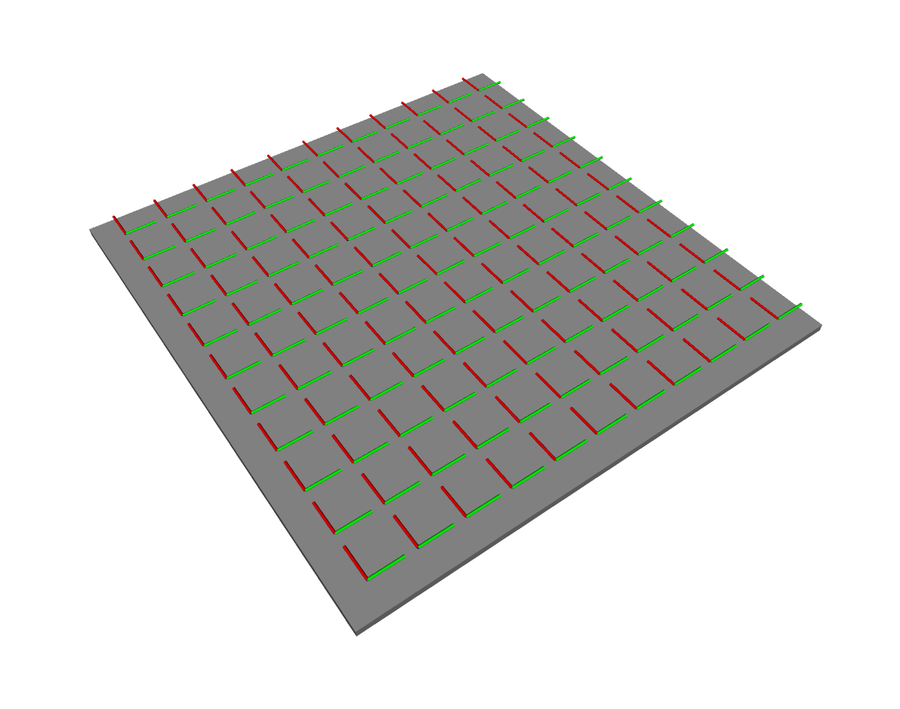
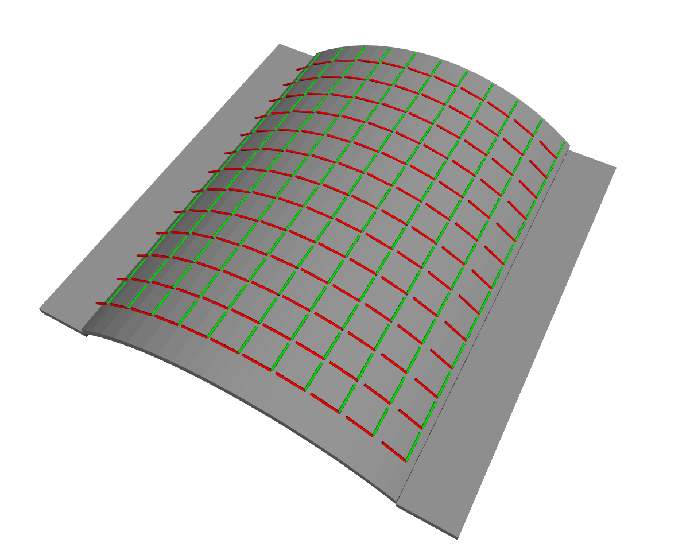
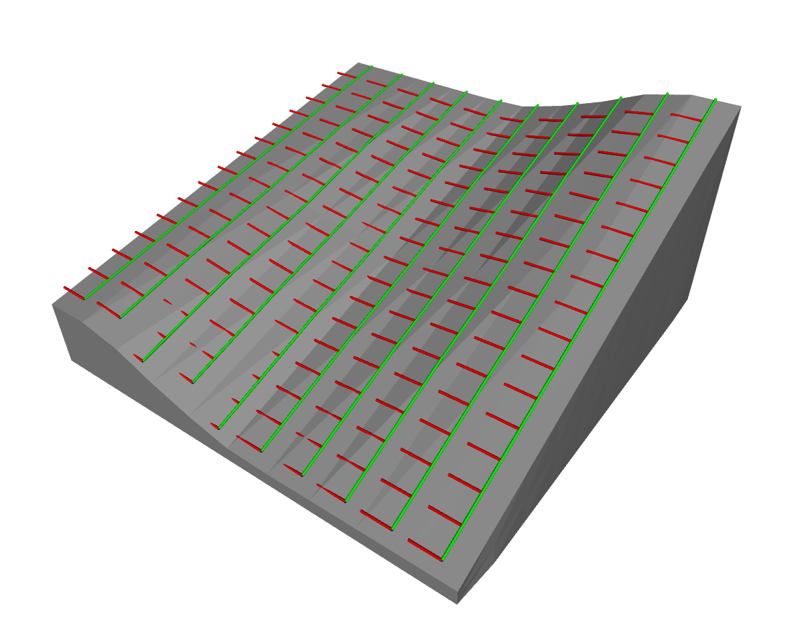
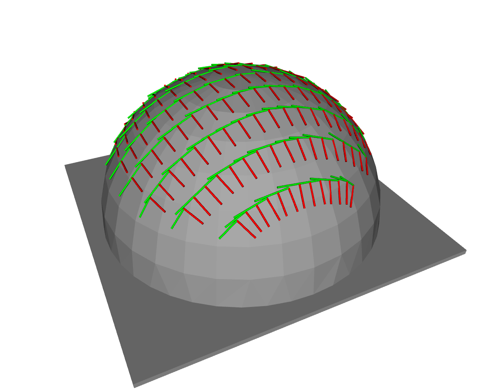
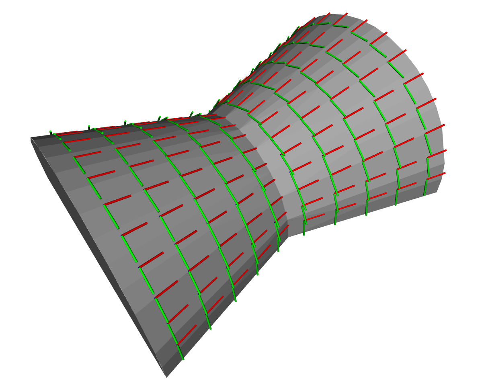

## Workpieces

The workpieces and their respective paths are provided in this folder. The CAD models of the workpieces are in STL format and the paths are defined as series of ROS poses in JSON format.

<table>
    <tr>
        <th>Workpiece A</th>
        <th>Workpiece B</th>
        <th>Workpiece C</th>
        <th>Workpiece D</th>
        <th>Workpiece E</th>
    </tr>
    <tr>
        <td></td>
        <td></td>
        <td></td>
        <td></td>
        <td></td>
    </tr>
    <tr>
        <td><a href="stl/flat_plate.stl">flat_plate.stl</a></td>
        <td><a href="stl/vaulted_plate.stl">vaulted_plate.stl</a></td>
        <td><a href="stl/double_curve.stl">double_curve.stl</a></td>
        <td><a href="stl/half_sphere.stl">half_sphere.stl</a></td>
        <td><a href="stl/three_arc.stl">three_arc.stl</a></td>
    </tr>
    <tr>
        <td><a href="paths/flat_plate.json">flat_plate.json</a></td>
        <td><a href="paths/vaulted_plate.json">vaulted_plate.json</a></td>
        <td><a href="paths/double_curve.json">double_curve.json</a></td>
        <td><a href="paths/half_sphere.json">half_sphere.json</a></td>
        <td><a href="paths/three_arc.json">three_arc.json</a></td>
    </tr>
</table>

The poses in the JSON files can be retrieved using the script provided below.

```python
import json
from geometry_msgs.msg import Pose, PoseArray 

def json_to_pose_array(stl_path):
    f = open(stl_path)
    path_data = json.load(f)
    f.close()

    stl_pa = PoseArray()
    stl_pa.header.frame_id = "stl_path_poses"

    for pose in path_data['path']['poses']:
        p = Pose()
        p.position.x = pose['position']['x']
        p.position.y = pose['position']['y']
        p.position.z = pose['position']['z']

        p.orientation.x = pose['orientation']['x']
        p.orientation.y = pose['orientation']['y']
        p.orientation.z = pose['orientation']['z']
        p.orientation.w = pose['orientation']['w']

        stl_pa.poses.append(p)

    return stl_pa
```
